# HMIN211 - Compte Rendu TP3 (Odorico Thibault)

## Sommaire

- [Expansion dynamique](#expansion-dynamique)
- [Seuillage des extrema](#seuillage-des-extrema)
- [Egalisation d'histogramme](#egalisation-d-histogramme)
- [Specification d'histogramme](#specification-d-histogramme)

## Expansion dynamique

| Image de reference              | Histogramme                           |
| ----------------                | -----------------------               |
| 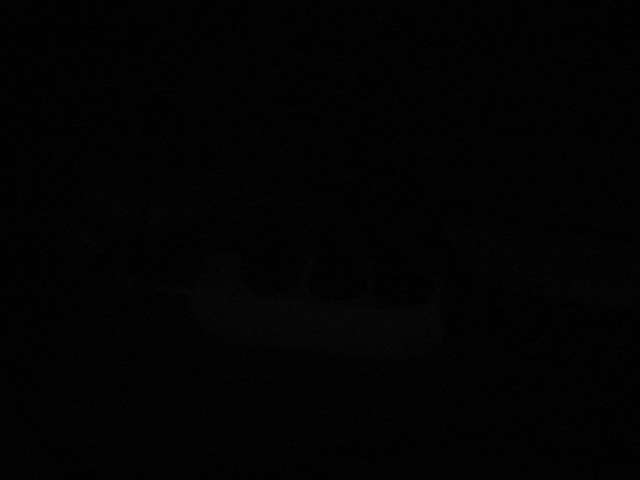           | 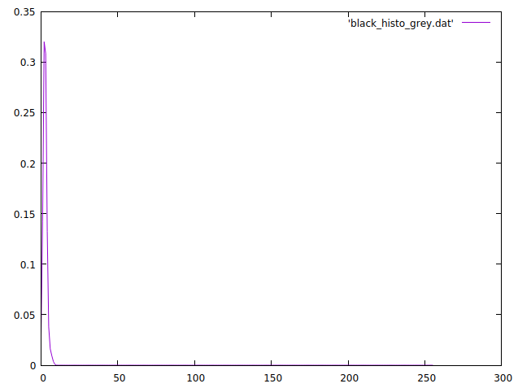      |

- Grace à l'histogramme on peut determiner les indices minimal/maximal pour lesquels l'image en niveau de gris a une valeur non nulle
	- min = 0 et max = 11

- On peut ainsi determiner les valeurs α et β : \(α = { 255 min \over max - min }\) et \(β = { 255 \over max - min }\)
	- α = 0 et β = 23.18

| Expansion (Niveaux de gris)     | Histogramme                           |
| ----------------                | -----------------------               |
| 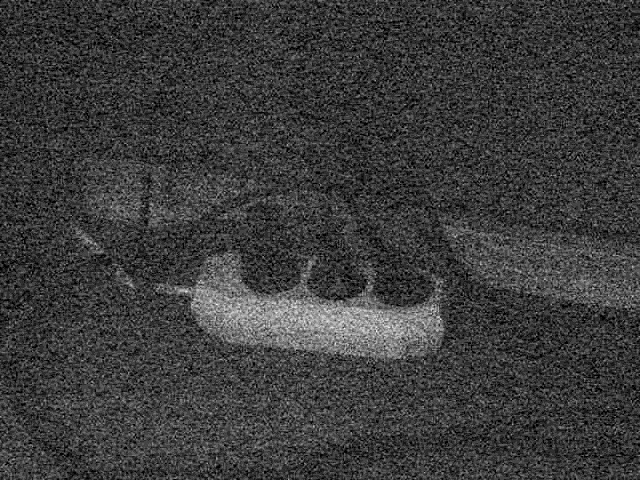  | 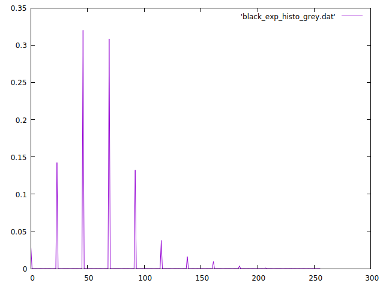  |

- En appliquant la même methode sur chaque composante pour l'image en couleur on trouve comme indice minimal/maximal :
	- minR = 0 et maxR = 13
	- minG = 0 et maxG = 12
	- minB = 0 et maxB = 12

- On peut ainsi determiné les valeurs α et β de chaque composantes
	- αR = 0 et βR = 19,61
	- αG = 0 et βG = 21,25
	- αB = 0 et βB = 21,25

| Expansion (Couleur)             | Histogramme                           |
| ----------------                | -----------------------               |
| 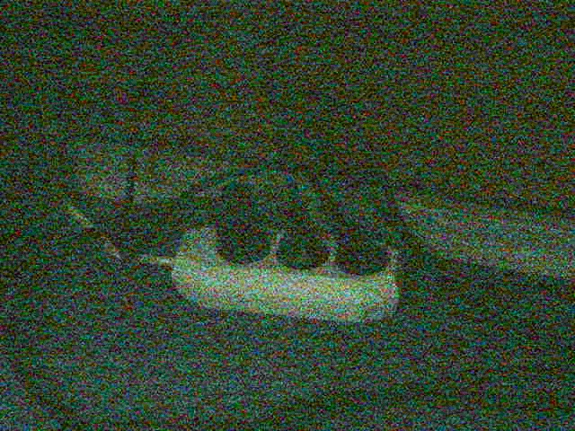 | 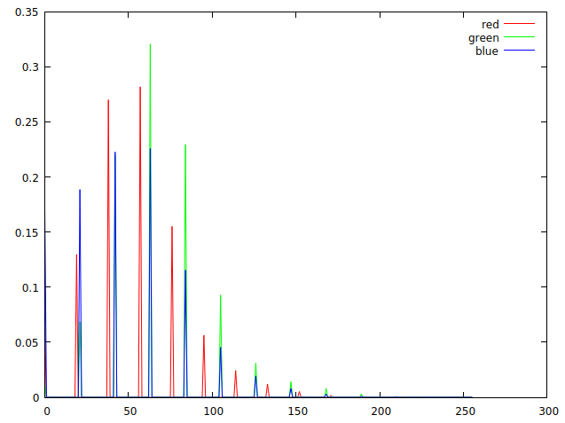 |

## Seuillage des extrema

| Image de reference           | Histogramme                        |
| ----------------             | -----------------------            |
| 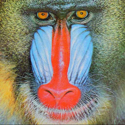       | 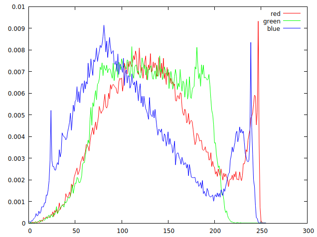       |

- Pour le seuil des extrema on choisis d'utilliser les paramètres suivant 
	- SminR = 47 et SmaxR = 230
	- SminG = 50 et SmaxG = 196
	- SminB = 25 et SmaxB = 220

| Image seuillée               | Histogramme                        |
| ----------------             | -----------------------            |
| 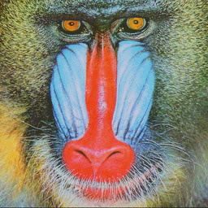 | 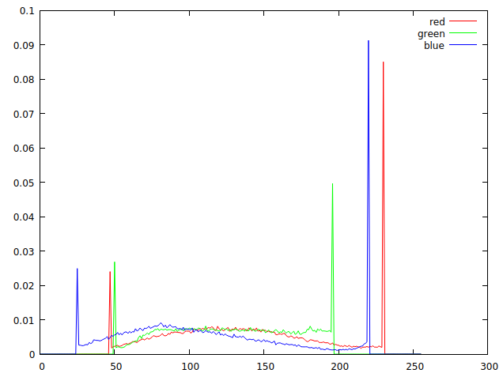 |

- Avec ces paramètres on observe une légère difference d'intensité de rouge sur le nez du baboin qui est ci-dessu moins rouge.

| Image expansion              | Histogramme                        |
| ----------------             | -----------------------            |
|  | 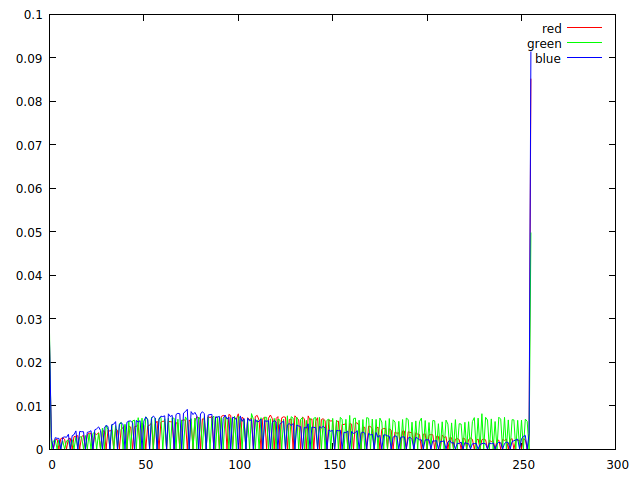 |

- En appliquant ensuit l'expansion dynamique on constate que l'image est devenu plus nette, les details sont mieux visibles.

## Egalisation d'histogramme

| Image de reference             | Histogramme                    |
| ----------------               | -----------------------        |
|              | 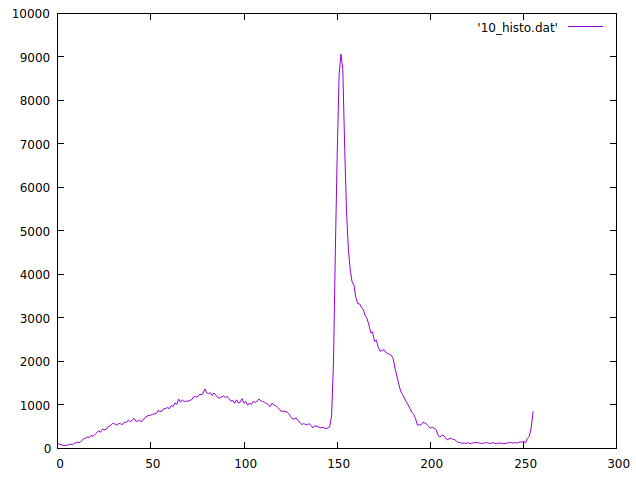       |

- En divisant chaque valeurs de l'histogramme par le nombre de pixels de l'image on obients la densité de probabilité de l'image et pour obtenir la fonction de repartition F(a) il suffit d'additionner chaque probabilité jusqu'a atteindre 1.

| Densité de probabilité         | Repartition F(a)               |
| ----------------               | -----------------------        |
| 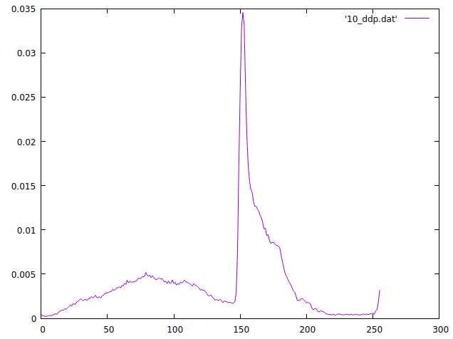         | 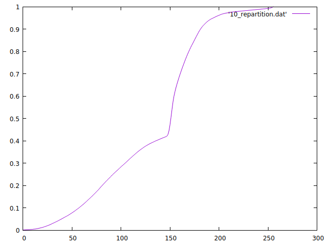 |

- Notre densité de probabilité nous permet de constater que les intensité entre 150 et 155 sont très presente comparé aux autres intensité dans notre image, c'est pourquoi dans notre fonction de repartition on remarque une forte augmentation de la pente aux indices 150 à 155

| Image egalisée                 | Histogramme                    |
| ----------------               | -----------------------        |
|  | 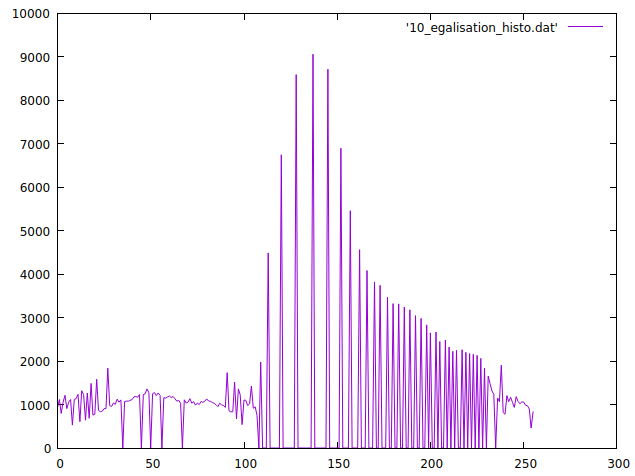 |

- Grace à notre fonction de repartition on peut ensuite calculé notre image egalisé, ce qui nous permet de regler le contraste de notre images.

## Specification d'histogramme

| Image de reference               | Image B                      | Histogramme              |
| ----------------                 | ----------------             | -----------------------  |
|              | 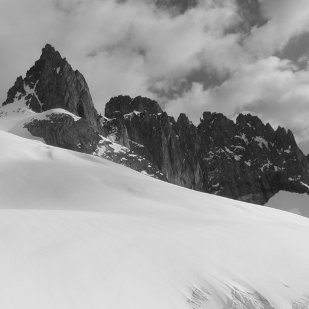           | 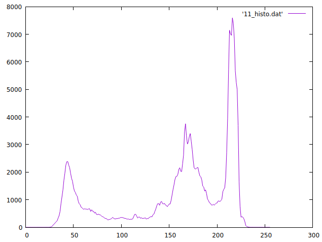 |

- Nous allons realiser un specification d'histogramme à l'aide de l'image lena pour reference et de l'image B que l'on egalisera

| Image egalisé B            	   | Histogramme                            |
| ----------------                 | -----------------------                |
| 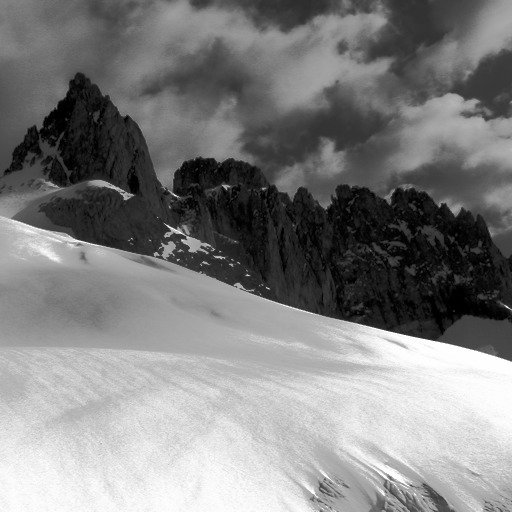   | 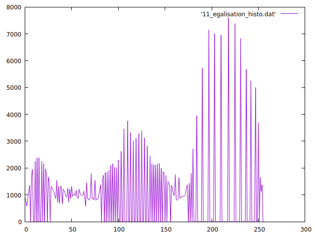   |

- En appliquant l'egalisation l'image est beaucoup plus contrasté et remarque que sont histogramme est egalisé avec quelques sacades

| Image specifié B           	   | Histogramme                            |
| ----------------                 | -----------------------                |
| 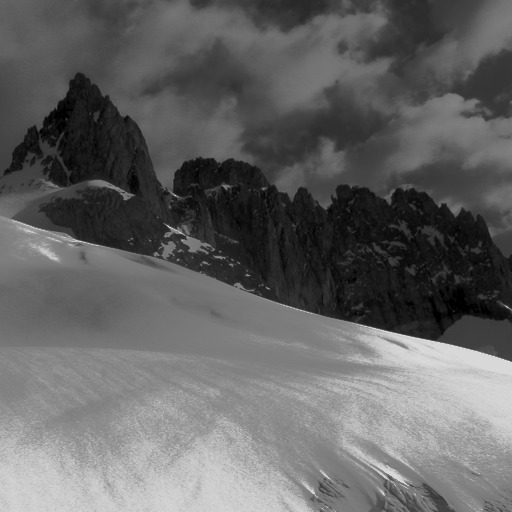 | 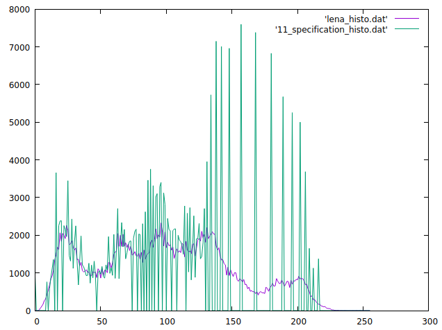 |

- Après l'egalisation on applique une transformation inverse en utillisant la fonction de repartition de l'image de reference et on constate que les intensité de gris des deux histogrammes ce sont calé les unes sur les autres, l'image est devenu plus grise tout en gardant les details que l'egalisation avait devoilé