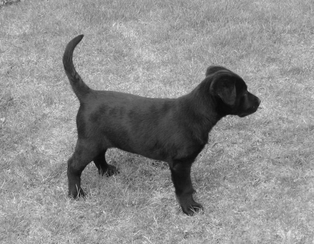
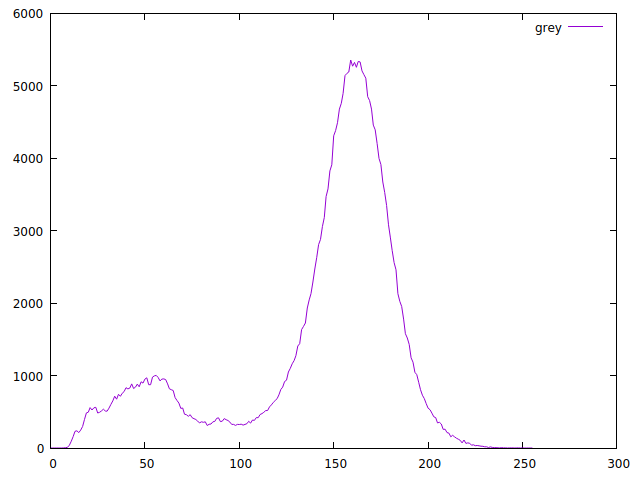
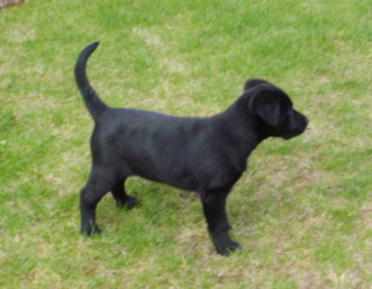
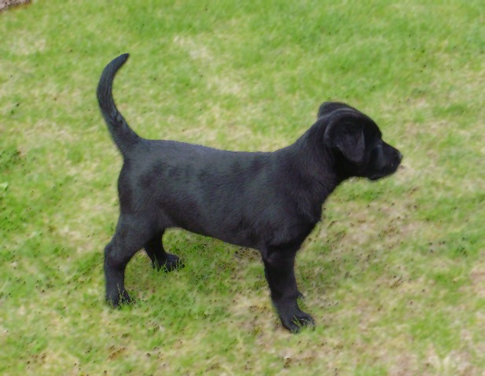
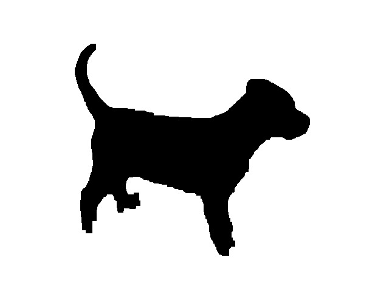
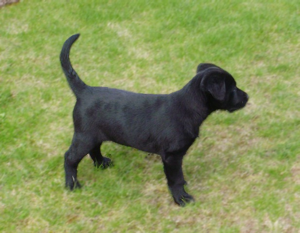
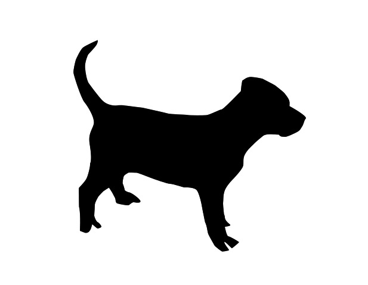
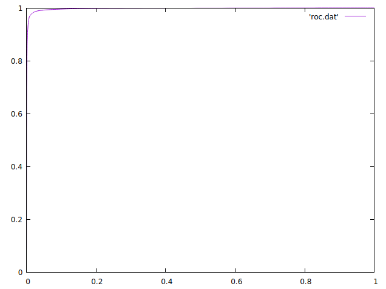
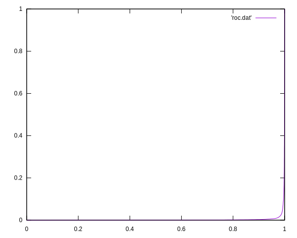

# HMIN211 - Compte Rendu TP4 (Odorico Thibault)

## Sommaire

<!-- MarkdownTOC autolink="true" -->

- [Image de reference](#image-de-reference)
- [Conversition en niveaux de gris](#conversition-en-niveaux-de-gris)
- [Seuillage de l'image en niveaux de gris](#seuillage-de-limage-en-niveaux-de-gris)
- [Floutage de l'image en couleur](#floutage-de-limage-en-couleur)
- [Floutage du fond de l'image en couleur](#floutage-du-fond-de-limage-en-couleur)
- [Amelioration de l'image binaire](#amelioration-de-limage-binaire)
- [Tracé d'une courbe ROC](#trac%C3%A9-dune-courbe-roc)

<!-- /MarkdownTOC -->

<style type='text/css'>
img {
  display: block;
  margin-left: auto;
  margin-right: auto;
}

 table {
   margin-left:auto; 
   margin-right:auto;
   width:100%;
 }
</style>


## Image de reference

|                                     |
| ----------------                    |
|                |

## Conversition en niveaux de gris

```c++
void to_greyscale(const ImagePPM& in, ImagePGM& out){

	for (size_t i = 0 ; i < in.height() ; ++i) {
		for (size_t j = 0 ; j < in.width() ; ++j) {
			
			out(i, j) = 0.299 * (double)in.red(i, j) + 0.587 * (double)in.green(i, j) + 0.114 * (double)in.blue(i, j);
		}
	}
}
```

| Image en niveaux de gris            | Histogramme                         |
| ----------------                    | -----------------------             |
|           |     |


## Seuillage de l'image en niveaux de gris

```c++
void seuillage_binaire(const ImagePGM& image, OCTET seuil){

	for (int i = 0; i < image.height(); ++i){
		for (int j = 0; j < image.width(); ++j){
	
			if (image(i,j) < seuil)
				image(i,j) = 0;
			else
				image(i,j) = 255;
		}
	}
}
```

A l'aide de l'histogramme et en faisant quelques test j'en deduis que le seuil 115 et un bon seuil

| Image en niveaux de gris            | Image seuillée  S = 115                    |
| ----------------                    | -----------------------             |
|           |      |

## Floutage de l'image en couleur

```c++
OCTET moyenne(const ImagePGM& im, size_t row, size_t column) {
	
	long sum = im(row, column);
	size_t nb_values = 1;

	// dans le sens horraire
	
	if (im.on_bounds(row-1, column)) {
		sum += im(row-1, column);
		nb_values++;
	}

	if (im.on_bounds(row-1, column+1)) {
		sum += im(row-1, column+1);
		nb_values++;
	}

	if (im.on_bounds(row, column+1)) {
		sum += im(row, column+1);
		nb_values++;
	}

	if (im.on_bounds(row-1, column+1)) {
		sum += im(row-1, column+1);
		nb_values++;
	}

	if (im.on_bounds(row-1, column)) {
		sum += im(row-1, column);
		nb_values++;
	}

	if (im.on_bounds(row-1, column-1)) {
		sum += im(row-1, column-1);
		nb_values++;
	}

	if (im.on_bounds(row, column-1)) {
		sum += im(row, column-1);
		nb_values++;
	}

	if (im.on_bounds(row+1, column-1)) {
		sum += im(row+1, column-1);
		nb_values++;
	}

	return sum / nb_values;
}
```

```c++
void blur(const ImagePPM& in, ImagePPM& out) {
	for (size_t i = 0 ; i < in.height() ; ++i) {
		for (size_t j = 0 ; j < in.width() ; ++j) {
			out.red(i, j) = moyenne(in.red(), i, j);
			out.green(i, j) = moyenne(in.green(), i, j);
			out.blue(i, j) = moyenne(in.blue(), i, j);
		}
	}
}
```

En applicant plusieurs fois l'algorithme de blur on peut augmenter le niveau de flou

| 3eme passe                       | 5eme passe                       |
| ------------                     | --                               |
|       |       |


## Floutage du fond de l'image en couleur

```c++
void blur(const ImagePPM& in, const ImagePGM& bin, ImagePPM& out) {
	for (size_t i = 0 ; i < in.height() ; ++i) {
		for (size_t j = 0 ; j < in.width() ; ++j) {
			
			if (bin(i,j) != 0) {
				out.red(i, j) = moyenne(in.red(), i, j);
				out.green(i, j) = moyenne(in.green(), i, j);
				out.blue(i, j) = moyenne(in.blue(), i, j);
			} else {
				out.red(i, j) = in.red(i, j);
				out.green(i, j) = in.green(i, j);
				out.blue(i, j) = in.blue(i, j);			
			}
		}
	}
}
```

| 3eme passe                       | 5eme passe                       |
| ------------                     | --                               |
|  |  |


## Amelioration de l'image binaire


```c++
void erosion(const ImagePGM& in, ImagePGM& out) {
	for (size_t i = 0; i < in.height(); ++i) {
		for (size_t j = 0; j < in.width(); ++j) {
			if (in(i, j) == 255)
				assign_voisins(out, i, j, 255);
		}
	}
}
```

```c++
void dilatation(const ImagePGM& in, ImagePGM& out) {
	for (size_t i = 0; i < in.height(); ++i) {
		for (size_t j = 0; j < in.width(); ++j) {
			if (in(i, j) == 0)
				assign_voisins(out, i, j, 0);
		}
	}
}
```

```c++
void enchainement(const ImagePGM& in, string arg, ImagePGM& out) {

	ImagePGM transform = in;

	for (size_t i = 0; i < arg.size(); ++i){

		if (arg[i] == 'E')
			erosion(transform, out);
		else if (arg[i] == 'D')
			dilatation(transform, out);

		transform = out;
	}
}
```

Avec l'enchainement **EEEEDDDDDDDDEEEE** on arrive finalement à enlever les points parasite de l'image

| 3eme passe                          |
| -----------------------             |
|  |

| 3eme passe                          | 5eme passe                          |
| -----------------------             | --                                  |
|  |  |

## Tracé d'une courbe ROC

| Image de vérité                        |
| -----------------------             |
|  |

Courbe roc en faisant la comparaison de l

| Courbe roc                          |
| -----------------------             |
|  |

| test                          |
| -----------------------             |
|  |

